# 🌟 4D Visualization Features Guide

This document explains the modern 4D visualization elements implemented in your GitHub profile README.

## 🎯 What is 4D Visualization?

4D visualization in the context of GitHub profiles refers to:
- **3D Elements**: Three-dimensional visual representations
- **Time Dimension**: Dynamic, time-based animations and updates
- **Interactive Components**: Elements that respond to user interaction
- **Real-time Data**: Live updating statistics and metrics

## 🚀 Implemented Features

### 1. **Animated Typing Effects**
```markdown

```
- Creates a typewriter effect with multiple rotating messages
- Customizable colors, fonts, and timing
- Adds dynamic movement to static text

### 2. **3D Contribution Snake Animation**
```yaml
# Generated via GitHub Actions
- name: Generate github-contribution-grid-snake.svg
  uses: Platane/snk/svg-only@v3
```
- Transforms your contribution graph into an animated snake
- Updates automatically every 24 hours
- Creates a 3D-like visual effect with the snake movement

### 3. **Dynamic Activity Graphs**
```markdown

```
- Real-time contribution activity visualization
- Gradient fills and smooth animations
- Time-based data representation (4th dimension)

### 4. **Interactive Skill Icons**
```markdown

```
- Animated skill badges with hover effects
- Modern iconography with consistent styling
- Responsive design elements

### 5. **Live Statistics Cards**
```markdown

```
- Real-time GitHub statistics
- Custom themes and color schemes
- Animated loading and transitions

## 🎨 Design Philosophy

### Color Scheme
- **Primary**: `#00D9FF` (Cyan Blue) - Modern, tech-focused
- **Background**: `#0D1117` (Dark) - GitHub dark theme compatible
- **Accent**: `#FF6B6B` (Coral) - For highlights and important elements
- **Text**: `#FFFFFF` (White) - High contrast readability

### Animation Principles
1. **Subtle Movement**: Animations enhance without distracting
2. **Performance Optimized**: Lightweight SVGs and optimized images
3. **Accessibility**: Respects user preferences for reduced motion
4. **Progressive Enhancement**: Works even if animations fail to load

## 🔧 Technical Implementation

### GitHub Actions Workflows
1. **Snake Animation** (`snake.yml`):
   - Runs every 24 hours
   - Generates contribution graph snake
   - Outputs to separate branch for hosting

2. **Stats Update** (`update-stats.yml`):
   - Runs every 6 hours
   - Updates dynamic content
   - Commits changes automatically

### Python Automation (`update_readme.py`)
- Fetches real-time GitHub statistics
- Updates dynamic content sections
- Maintains README freshness

## 🌟 Advanced Features

### Mermaid Diagrams

```mermaid
graph TD
    A[🎯 Current Focus] --> B[Software Development]
    A --> C[Cloud Technologies]
    A --> D[System Design]
```

- Interactive flowcharts and diagrams
- Rendered directly in GitHub
- Supports complex visualizations

### Profile View Counter
```markdown

```
- Real-time visitor tracking
- Custom styling to match theme
- Persistent across sessions

## 🚀 Future Enhancements

### Planned 4D Features
1. **WebGL 3D Models**: Embedded 3D skill visualizations
2. **Real-time Coding Activity**: Live coding session displays
3. **Interactive Timeline**: 3D project history navigation
4. **Holographic Effects**: CSS-based 3D transformations
5. **AR/VR Integration**: QR codes linking to 3D experiences

### Performance Optimizations
- Lazy loading for heavy animations
- Reduced motion alternatives
- Mobile-responsive 3D elements
- Caching strategies for real-time data

## 📱 Mobile Responsiveness

All 4D elements are designed to work across devices:
- **Desktop**: Full animations and interactions
- **Tablet**: Optimized touch interactions
- **Mobile**: Simplified animations, core functionality preserved

## 🎯 Best Practices

1. **Keep It Fast**: Optimize all images and animations
2. **Accessibility First**: Provide alternatives for screen readers
3. **Progressive Enhancement**: Core content works without JavaScript
4. **Regular Updates**: Keep statistics and content fresh
5. **Cross-browser Testing**: Ensure compatibility across browsers

## 🔗 Resources and Tools

- [Typing SVG Generator](https://readme-typing-svg.herokuapp.com/)
- [GitHub Readme Stats](https://github.com/anuraghazra/github-readme-stats)
- [Skill Icons](https://skillicons.dev/)
- [GitHub Activity Graph](https://github.com/Ashutosh00710/github-readme-activity-graph)
- [Profile Trophy](https://github.com/ryo-ma/github-profile-trophy)

---

**Remember**: The goal is to create an engaging, professional profile that showcases your skills while maintaining excellent performance and accessibility standards.
