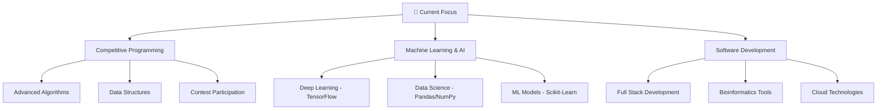

<div align="center">
  
# Hi there, I'm Saurabh Bajpai 👋


</div>

## 🚀 About Me


```javascript
const saurabh = {
    pronouns: "He/Him",
    location: "India 🇮🇳",
    currentFocus: "Competitive Programming & Data Science",
    languages: ["Java", "Python", "C++", "JavaScript", "SQL"],
    databases: ["MySQL", "PostgreSQL", "MongoDB"],
    frameworks: ["Spring Boot", "Django", "React", "Node.js"],
    mlLibraries: ["TensorFlow", "Scikit-Learn", "Pandas", "NumPy"],
    tools: ["Git", "Docker", "AWS", "Linux", "IntelliJ IDEA", "VS Code", "Jupyter"],
    currentlyLearning: ["Advanced ML Algorithms", "Deep Learning", "System Design"],
    lookingFor: "Software Development & Data Science Opportunities",
    funFact: "I can train neural networks and solve competitive programming problems! 🤖🚀"
};
```

<div align="center">

## 📊 GitHub Stats & Analytics


</div>

## 🏆 GitHub Trophies

<div align="center">
  


</div>

## 🛠️ Tech Stack & Skills

<div align="center">

### 💻 Programming Languages


### 🌐 Web Technologies


### 🗄️ Databases & Cloud


### 🔧 Tools & IDEs


### 📊 Data Science & Machine Learning


**Core Libraries:** `pandas` • `numpy` • `scikit-learn` • `matplotlib` • `seaborn` • `jupyter`

</div>

## 🏆 Competitive Programming & Data Science Profiles

<div align="center">

### 💻 Competitive Programming
| Platform | Profile | Stats |
|----------|---------|-------|
| 🟡 **LeetCode** | [@saurabhhhcodes](https://leetcode.com/saurabhhhcodes) |  |
| 🔵 **Codeforces** | [@saurabhhhcodes](https://codeforces.com/profile/saurabhhhcodes) |  |

### 📊 Data Science & Machine Learning
<div align="center">
  <a href="https://kaggle.com/saurabhbajpai">
    
  </a>
  <a href="https://kaggle.com/saurabhbajpai">
    
  </a>
  <a href="https://kaggle.com/saurabhbajpai">
    
  </a>
</div>

### 🤖 Machine Learning Expertise
<div align="center">
  
  
  
  
</div>

**ML Specializations:**
- 🧠 **Deep Learning**: Neural Networks, CNNs, RNNs
- 📈 **Supervised Learning**: Classification, Regression, Ensemble Methods
- 🔍 **Unsupervised Learning**: Clustering, Dimensionality Reduction
- 📊 **Data Analysis**: Statistical Analysis, Feature Engineering, Visualization

### 🎯 Coding Achievements
<div align="center">
  
  
  
</div>

</div>

## ✨ 4D Visualization & Interactive Elements

<div align="center">

### 🌟 3D Contribution Graph


### 📈 Dynamic Activity Metrics


### 🎯 Skill Progress Visualization


</div>

## 🌟 Current Focus & Learning Path

<div align="center">



### 🚀 Currently Working On
- 🏆 **Daily LeetCode Practice** - Solving algorithmic challenges
- 🤖 **Machine Learning Projects** - Building predictive models with TensorFlow & Scikit-Learn
- 🧬 **Bioinformatics Tools** - GeneInsight & Sequence Analysis platforms
- 📊 **Data Science Pipelines** - End-to-end ML workflows with Pandas & NumPy
- 🌐 **Full Stack Development** - Modern web applications with React & Spring Boot

</div>

## 🚀 Featured Projects

<div align="center">

### 🧬 **GeneInsight** - Bioinformatics Analysis Platform
<a href="https://github.com/saurabhhhcodes/geneinsigt">
  
</a>

**Advanced bioinformatics tool for genetic data analysis and visualization**
- 🔬 **Tech Stack**: Python, Bioinformatics Libraries, Data Visualization
- 🎯 **Features**: Gene sequence analysis, mutation detection, phylogenetic analysis
- 📊 **Impact**: Streamlines genetic research workflows for researchers
- 🌟 **Highlights**: Interactive visualizations, batch processing, export capabilities

---

### 🧬 **Sequence Analysis Tool** - DNA/RNA Processing Suite
<a href="https://github.com/saurabhhhcodes/sequence-analysis-tool">
  
</a>

**Comprehensive toolkit for biological sequence analysis and manipulation**
- 🔬 **Tech Stack**: Python, BioPython, NumPy, Matplotlib
- 🎯 **Features**: Sequence alignment, motif finding, GC content analysis
- 📈 **Capabilities**: Statistical analysis, pattern recognition, format conversion
- 🌟 **Highlights**: Command-line interface, batch processing, detailed reports

---

### 👥 **DevColabPlatform** - Developer Collaboration Hub
<a href="https://github.com/saurabhhhcodes/devcolabpaltform">
  
</a>

**Modern platform for developer collaboration and project management**
- 💻 **Tech Stack**: Full Stack Development, Real-time Communication
- 🎯 **Features**: Project collaboration, code sharing, team management
- 🚀 **Capabilities**: Real-time chat, file sharing, version control integration
- 🌟 **Highlights**: Modern UI/UX, scalable architecture, cross-platform support

### 📊 Project Statistics
<div align="center">
  
  
  
</div>

</div>

## 📫 Let's Connect!

<div align="center">

<a href="https://www.linkedin.com/in/saurabhbajpai03">
  
</a>
<a href="mailto:saurabhbajpai03@outlook.com">
  
</a>
<a href="https://github.com/saurabhhhcodes">
  
</a>

### 💬 Feel free to reach out for:
- 🤝 Collaboration opportunities
- 💼 Software development roles
- 🧠 Tech discussions
- 📚 Knowledge sharing

</div>

<div align="center">

### 👀 Profile Views


---


**"Code is like humor. When you have to explain it, it's bad."** – Cory House


</div>
