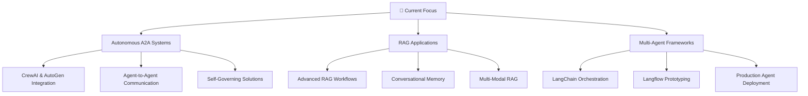

<div align="center">

<h1>Saurabh Kumar Bajpai</h1>

<strong>AI Engineer · Open Source Contributor · Agentic Systems</strong>

<br>


<br><br>

**AI · RAG · Backend · Security · Testing · CI/CD**  
**GSSoC #8 · GSoC 2026 · NSoC 2026**

<br>

<a href="https://gssoc.girlscript.org/profile/6a73d848-056f-4043-a79b-83dfc87113ac">
  
</a>

<a href="https://summerofcode.withgoogle.com/">
  
</a>

<a href="https://github.com/saurabhhhcodes">
  
</a>

<a href="https://github.com/saurabhhhcodes?tab=followers">
  
</a>

<br><br>

<div align="center">
  <a href="https://gssoc.girlscript.org/profile/6a73d848-056f-4043-a79b-83dfc87113ac">
    
    
    
    
    
    
    
    
    
    
    
    
    
    
    
    
  </a>
</div>

<div align="center">
  <a href="https://gssoc.girlscript.org/profile/6a73d848-056f-4043-a79b-83dfc87113ac">
    
    
    
    
    
    
  </a>
</div>

</div>

<br>

### Open Source Work · 2026

I ship working PRs across GSSoC, NSoC, and GSoC-aligned projects — AI systems, backend reliability, security hardening, testing, CI, and documentation.


<div align="center">


<br>


</div>

## Open Source Programs 2026

- **GirlScript Summer of Code 2026:** Contributor across Open Source + AI/Agents tracks, shipping reviewed PRs in AI/ML, RAG, agentic systems, backend reliability, security hardening, CI/testing, and documentation.
- **Nexus Spring of Code 2026:** Contributor to fast-moving Nexus projects with focus on tested, useful, maintainable changes.
- **Google Summer of Code 2026:** Contributor focused on production-minded implementation, clean architecture, documentation, and reviewer-friendly notes.


## 🌟 Open Source Contributions

<div align="center">

I contribute to a wide range of open-source projects across AI/ML, web development, developer tooling, security, and more.

</div>

<br/>

### 🤖 AI/ML & Agent Systems

| Project | Original Repo | Description | Live Demo |
|---------|--------------|-------------|-----------|
| [**AegisAI**](https://github.com/saurabhhhcodes/AegisAI) | [SdSarthak/AegisAI](https://github.com/SdSarthak/AegisAI) | Open-source AI Governance, Risk & Compliance (AI-GRC) platform | [🌐 Live](https://github.com/SdSarthak/AegisAI) |
| [**ai-code-reviewer**](https://github.com/saurabhhhcodes/ai-code-reviewer) | [kalyan-1845/ai-code-reviewer](https://github.com/kalyan-1845/ai-code-reviewer) | AI-powered automated code review tool | |
| [**AI-dev-assistant**](https://github.com/saurabhhhcodes/AI-dev-assistant) | [imDarshanGK/AI-dev-assistant](https://github.com/imDarshanGK/AI-dev-assistant) | AI-powered developer assistant for beginners | [🌐 Live](https://qyverixai.onrender.com) |
| [**AI-Based-Video-Emotion-Detection**](https://github.com/saurabhhhcodes/AI-Based-Video-Emotion-Detection) | [divya16-boriwar/AI-Based-Video-Emotion-Detection](https://github.com/divya16-boriwar/AI-Based-Video-Emotion-Detection) | Video emotion detection using computer vision | |
| [**arcmindAI**](https://github.com/saurabhhhcodes/arcmindAI) | [SATYAM-PRATIBHAN/arcmindAI](https://github.com/SATYAM-PRATIBHAN/arcmindAI) | AI-powered system architecture generator | [🌐 Live](https://arcmind-ai.netlify.app) |
| [**Clinical-Insight-Engine**](https://github.com/saurabhhhcodes/Clinical-Insight-Engine) | [gopaljilab/Clinical-Insight-Engine](https://github.com/gopaljilab/Clinical-Insight-Engine) | Full-stack clinical decision support system | |
| [**iloveAgents**](https://github.com/saurabhhhcodes/iloveAgents) | [AditthyaSS/iloveAgents](https://github.com/AditthyaSS/iloveAgents) | AI agents built by the community | [🌐 Live](https://iloveagents.vercel.app/) |
| [**LogWatch-AI**](https://github.com/saurabhhhcodes/LogWatch-AI) | [kumariluckyraj/LogWatch-AI](https://github.com/kumariluckyraj/LogWatch-AI) | AI log monitoring and analysis | |
| [**MicroAI-Paygate**](https://github.com/saurabhhhcodes/MicroAI-Paygate) | [AnkanMisra/MicroAI-Paygate](https://github.com/AnkanMisra/MicroAI-Paygate) | Crypto-monetized AI microservice architecture | [🌐 Live](https://microai-paygate.vercel.app) |
| [**PDF-Assistant-RAG**](https://github.com/saurabhhhcodes/PDF-Assistant-RAG) | [param20h/PDF-Assistant-RAG](https://github.com/param20h/PDF-Assistant-RAG) | AI document assistant with RAG | [🌐 Live](https://param20h-pdf-assit-rag.hf.space) |
| [**story-spark-ai**](https://github.com/saurabhhhcodes/story-spark-ai) | [ronisarkarexe/story-spark-ai](https://github.com/ronisarkarexe/story-spark-ai) | Open-source creative story generation platform | [🌐 Live](https://storysparkai.vercel.app) |
| [**VidyaSetu**](https://github.com/saurabhhhcodes/VidyaSetu) | [MRIARC-08/VidyaSetu](https://github.com/MRIARC-08/VidyaSetu) | AI-powered NCERT study platform | [🌐 Live](https://vidya-setu-olive.vercel.app) |
| [**AlgoBuddy**](https://github.com/saurabhhhcodes/AlgoBuddy) | [PankajSingh34/AlgoBuddy](https://github.com/PankajSingh34/AlgoBuddy) | Algorithm learning companion | |
| [**NeuroVision**](https://github.com/saurabhhhcodes/NeuroVision) | [Brijeshthummar02/NeuroVision](https://github.com/Brijeshthummar02/NeuroVision) | Computer vision project | |
| [**KisanAI**](https://github.com/saurabhhhcodes/KisanAI) | [asheesh109/KisanAI](https://github.com/asheesh109/KisanAI) | AI for agriculture | [🌐 Live](https://kisan-ai-m12i.vercel.app/) |
| [**business-ai-agent**](https://github.com/saurabhhhcodes/business-ai-agent) | [mohitkumhar/business-ai-agent](https://github.com/mohitkumhar/business-ai-agent) | Business AI agent | |
| [**career-pilot**](https://github.com/saurabhhhcodes/career-pilot) | [anurag3407/career-pilot](https://github.com/anurag3407/career-pilot) | AI-powered career platform for resume optimization & mock interviews | |

### 🌐 Web Apps & Full Stack

| Project | Original Repo | Description | Live Demo |
|---------|--------------|-------------|-----------|
| [**100_days_100_web_project**](https://github.com/saurabhhhcodes/100_days_100_web_project) | [dhairyagothi/100_days_100_web_project](https://github.com/dhairyagothi/100_days_100_web_project) | 100 web projects from basic to intermediate | [🌐 Live](https://100-days-100-web-project.vercel.app/) |
| [**Blood-Connect-By-ChronalLabs**](https://github.com/saurabhhhcodes/Blood-Connect-By-ChronalLabs) | [ChronalLabs/Blood-Connect-By-ChronalLabs](https://github.com/ChronalLabs/Blood-Connect-By-ChronalLabs) | Blood donation connect platform | [🌐 Live](https://blood-connect-by-chronallabs.onrender.com/) |
| [**BiblioDrift**](https://github.com/saurabhhhcodes/BiblioDrift) | [devanshi14malhotra/BiblioDrift](https://github.com/devanshi14malhotra/BiblioDrift) | Digital bookstore experience | [🌐 Live](https://bibliodrift-dm.netlify.app/) |
| [**CertiNova**](https://github.com/saurabhhhcodes/CertiNova) | [12fahed/CertiNova](https://github.com/12fahed/CertiNova) | Bulk certificate generator & validator | [🌐 Live](https://certinova.vercel.app) |
| [**Checkora**](https://github.com/saurabhhhcodes/Checkora) | [Checkora/Checkora](https://github.com/Checkora/Checkora) | Chess platform with AI opponent | [🌐 Live](https://checkora.vercel.app) |
| [**CODEVIBE-**](https://github.com/saurabhhhcodes/CODEVIBE-) | [JiyaBatra/CODEVIBE-](https://github.com/JiyaBatra/CODEVIBE-) | Interactive learning platform for beginners | [🌐 Live](https://codevibeforyou.netlify.app/) |
| [**DevPath-Web**](https://github.com/saurabhhhcodes/DevPath-Web) | [devpathindcommunity-india/DevPath-Web](https://github.com/devpathindcommunity-india/DevPath-Web) | DevPath Community Website | [🌐 Live](https://devpath-website.web.app/) |
| [**Draftdeckai**](https://github.com/saurabhhhcodes/Draftdeckai) | [Muneerali199/Draftdeckai](https://github.com/Muneerali199/Draftdeckai) | AI-powered document creation platform | [🌐 Live](https://draftdeckai.com) |
| [**Easy.js_v.3.0.0**](https://github.com/saurabhhhcodes/Easy.js_v.3.0.0) | [thunderavi/Easy.js_v.3.0.0](https://github.com/thunderavi/Easy.js_v.3.0.0) | Developer-friendly backend DSL & framework | [🌐 Live](https://www.npmjs.com/package/easybackend.js) |
| [**Eventra**](https://github.com/saurabhhhcodes/Eventra) | [SandeepVashishtha/Eventra](https://github.com/SandeepVashishtha/Eventra) | Comprehensive event management system | [🌐 Live](https://eventra.sandeepvashishtha.in) |
| [**FlowForge**](https://github.com/saurabhhhcodes/FlowForge) | [Shriii19/FlowForge](https://github.com/Shriii19/FlowForge) | Developer collaboration platform | [🌐 Live](https://flowforge.nexly.store/) |
| [**HELPDESK.AI**](https://github.com/saurabhhhcodes/HELPDESK.AI) | [ritesh-1918/HELPDESK.AI](https://github.com/ritesh-1918/HELPDESK.AI) | Full-stack AI helpdesk platform | [🌐 Live](https://helpdeskai1918.vercel.app) |
| [**InternHack**](https://github.com/saurabhhhcodes/InternHack) | [Sachinchaurasiya360/InternHack](https://github.com/Sachinchaurasiya360/InternHack) | All-in-one hackathon SaaS platform | [🌐 Live](https://internhack.xyz) |
| [**KrishiSetu**](https://github.com/saurabhhhcodes/KrishiSetu) | [aditiraj2006/KrishiSetu](https://github.com/aditiraj2006/KrishiSetu) | Farm-to-consumer traceability platform | [🌐 Live](https://krishisetu-server.onrender.com) |
| [**MagicBoard**](https://github.com/saurabhhhcodes/MagicBoard) | [binarycodon/MagicBoard](https://github.com/binarycodon/MagicBoard) | Drawing shapes & images for SDLC diagramming | |
| [**MedInternia**](https://github.com/saurabhhhcodes/MedInternia) | [AnirudhPhophalia/MedInternia](https://github.com/AnirudhPhophalia/MedInternia) | Medical internship platform | [🌐 Live](https://medinternia.vercel.app/) |
| [**MooVit**](https://github.com/saurabhhhcodes/MooVit) | [ShubhangiRoy12/MooVit](https://github.com/ShubhangiRoy12/MooVit) | Smart safety assistant for visually impaired | [🌐 Live](https://moo-vit.vercel.app) |
| [**NyayaVanni**](https://github.com/saurabhhhcodes/NyayaVanni) | [choudharyms/NyayaVanni](https://github.com/choudharyms/NyayaVanni) | Legal assistance platform | [🌐 Live](https://nyaya-vanni.vercel.app) |
| [**OPSCORD**](https://github.com/saurabhhhcodes/OPSCORD) | [probably-ABHINAV/OPSCORD](https://github.com/probably-ABHINAV/OPSCORD) | Ops coordination tool | [🌐 Live](https://opscord-six.vercel.app) |
| [**PiperChat01**](https://github.com/saurabhhhcodes/PiperChat01) | [chthonn/PiperChat01](https://github.com/chthonn/PiperChat01) | Discord-style real-time chat app | [🌐 Live](https://piperchat.vercel.app) |
| [**QuickSheet**](https://github.com/saurabhhhcodes/QuickSheet) | [cemheren/QuickSheet](https://github.com/cemheren/QuickSheet) | Terminal spreadsheet / interactive desktop wallpaper | [🌐 Live](https://cemheren.github.io/QuickSheet/) |
| [**ReadmeForge**](https://github.com/saurabhhhcodes/ReadmeForge) | [Mohit-368/ReadmeForge](https://github.com/Mohit-368/ReadmeForge) | Beautiful GitHub READMEs without Markdown knowledge | [🌐 Live](https://makeareadme.netlify.app/) |
| [**reframe**](https://github.com/saurabhhhcodes/reframe) | [magic-peach/reframe](https://github.com/magic-peach/reframe) | Free, open-source browser video editor | [🌐 Live](https://reframe-lilac.vercel.app/) |
| [**SafeVoice**](https://github.com/saurabhhhcodes/SafeVoice) | [Piyushydv08/SafeVoice](https://github.com/Piyushydv08/SafeVoice) | AI-powered anonymous support platform | [🌐 Live](https://safevoiceforwomen.netlify.app/) |
| [**sahidawa-india**](https://github.com/saurabhhhcodes/sahidawa-india) | [RatLoopz/sahidawa-india](https://github.com/RatLoopz/sahidawa-india) | Medicine verification & pharmacy finder | [🌐 Live](https://sahidawa-india-web.vercel.app) |
| [**SnapPass-AI**](https://github.com/saurabhhhcodes/SnapPass-AI) | [souma9830/SnapPass-AI](https://github.com/souma9830/SnapPass-AI) | AI-powered pass generation | [🌐 Live](https://snap-pass-ai-rho.vercel.app/) |
| [**StackIt**](https://github.com/saurabhhhcodes/StackIt) | [Ashmita1206/StackIt](https://github.com/Ashmita1206/StackIt) | Modern full-stack Q&A platform | [🌐 Live](https://stack-it-v6rz.vercel.app/) |
| [**SuperBrowser**](https://github.com/saurabhhhcodes/SuperBrowser) | [PandyaJeet/SuperBrowser](https://github.com/PandyaJeet/SuperBrowser) | Next-gen browsing platform with AI tools | [🌐 Live](https://superbrowser.web.app/) |
| [**Tessera.io**](https://github.com/saurabhhhcodes/Tessera.io) | [Kushaal-k/Tessera.io](https://github.com/Kushaal-k/Tessera.io) | Collaborative developer sandbox | |
| [**The-Leetcode-City**](https://github.com/saurabhhhcodes/The-Leetcode-City) | [Ixotic27/The-Leetcode-City](https://github.com/Ixotic27/The-Leetcode-City) | LeetCode practice platform | [🌐 Live](https://the-leetcode-city.vercel.app) |
| [**The-Pacman-Game**](https://github.com/saurabhhhcodes/The-Pacman-Game) | [dishu4u/The-Pacman-Game](https://github.com/dishu4u/The-Pacman-Game) | Classic Pac-Man in Java Swing/AWT | |
| [**UltimateHealth**](https://github.com/saurabhhhcodes/UltimateHealth) | [SB2318/UltimateHealth](https://github.com/SB2318/UltimateHealth) | Open-source health library & article platform | [🌐 Live](https://uhsocial.in) |
| [**Vura**](https://github.com/saurabhhhcodes/Vura) | [omn7/Vura](https://github.com/omn7/Vura) | Event certificate generation & verification | |
| [**Zeroly**](https://github.com/saurabhhhcodes/Zeroly) | [Sumwanyuno/Zeroly](https://github.com/Sumwanyuno/Zeroly) | Zero-waste platform | [🌐 Live](https://zeroly.netlify.app/) |
| [**S72_Gaurav_Capstone_KampusKart**](https://github.com/saurabhhhcodes/S72_Gaurav_Capstone_KampusKart) | [Gaurav-205/S72_Gaurav_Capstone_KampusKart](https://github.com/Gaurav-205/S72_Gaurav_Capstone_KampusKart) | Campus portal — events, lost & found, clubs | [🌐 Live](https://kampuskart.netlify.app) |
| [**otpauthentication**](https://github.com/saurabhhhcodes/otpauthentication) | [OpenTekHub/otpauthentication](https://github.com/OpenTekHub/otpauthentication) | Twilio + FastAPI OTP authentication | |
| [**SmartClassroom**](https://github.com/saurabhhhcodes/SmartClassroom) | [Souhridya-Patra/SmartClassroom](https://github.com/Souhridya-Patra/SmartClassroom) | Automated classroom management system | |
| [**codelockr-react**](https://github.com/saurabhhhcodes/codelockr-react) | [sleeptil3/codelockr-react](https://github.com/sleeptil3/codelockr-react) | Code snippets storage for developers | |
| [**LuvLyricsApp**](https://github.com/saurabhhhcodes/LuvLyricsApp) | [LuvLyricsApp/LuvLyricsApp](https://github.com/LuvLyricsApp/LuvLyricsApp) | Lyrics application | |
| [**LeadOrbit**](https://github.com/saurabhhhcodes/LeadOrbit) | [Kuldeeep18/LeadOrbit](https://github.com/Kuldeeep18/LeadOrbit) | Lead management platform | |

### 🛠️ Developer Tools & Libraries

| Project | Original Repo | Description | Live Demo |
|---------|--------------|-------------|-----------|
| [**arnio**](https://github.com/saurabhhhcodes/arnio) | [im-anishraj/arnio](https://github.com/im-anishraj/arnio) | C++-accelerated data quality toolkit for Python | [🌐 Live](https://arnio.vercel.app/) |
| [**CodeGraphContext**](https://github.com/saurabhhhcodes/CodeGraphContext) | [CodeGraphContext/CodeGraphContext](https://github.com/CodeGraphContext/CodeGraphContext) | MCP server + CLI for code graph context | [🌐 Live](https://cgc.codes) |
| [**devtrack**](https://github.com/saurabhhhcodes/devtrack) | [Priyanshu-byte-coder/devtrack](https://github.com/Priyanshu-byte-coder/devtrack) | Developer productivity dashboard | [🌐 Live](https://devtrack-delta.vercel.app) |
| [**dripsflow**](https://github.com/saurabhhhcodes/dripsflow) | [Ugasutun/fundflow](https://github.com/Ugasutun/fundflow) | Web3 contributor funding dashboard | [🌐 Live](https://dripsflow.vercel.app/) |
| [**ELDA**](https://github.com/saurabhhhcodes/ELDA) | [ayushmaan-verma/ELDA](https://github.com/ayushmaan-verma/ELDA) | C++17 linear algebra library | [🌐 Live](https://elda-three.vercel.app) |
| [**EnvForage**](https://github.com/saurabhhhcodes/EnvForage) | [rishabh0510rishabh/EnvForage](https://github.com/rishabh0510rishabh/EnvForage) | Environment variable manager | [🌐 Live](https://envforage.xyz) |
| [**fauxx**](https://github.com/saurabhhhcodes/fauxx) | [digital-grease/fauxx](https://github.com/digital-grease/fauxx) | Data poisoning for tracking protection | |
| [**Find**](https://github.com/saurabhhhcodes/Find) | [Abhash-Chakraborty/Find](https://github.com/Abhash-Chakraborty/Find) | Local-first AI-powered image search | |
| [**github-profile-analyzer**](https://github.com/saurabhhhcodes/github-profile-analyzer) | [0xarchit/github-profile-analyzer](https://github.com/0xarchit/github-profile-analyzer) | AI-powered GitHub profile analyzer | [🌐 Live](https://github.0xarchit.is-a.dev) |
| [**gitverse-nextjs**](https://github.com/saurabhhhcodes/gitverse-nextjs) | [nisshchayarathi/gitverse-nextjs](https://github.com/nisshchayarathi/gitverse-nextjs) | Interactive GitHub repo architecture map | |
| [**gssoc-ops**](https://github.com/saurabhhhcodes/gssoc-ops) | [NachiketPatil26/gssoc-ops](https://github.com/NachiketPatil26/gssoc-ops) | Claude Code skill for GSSoC contributions | |
| [**hybrid-recommender**](https://github.com/saurabhhhcodes/hybrid-recommender) | [leonagoel/hybrid-recommender](https://github.com/leonagoel/hybrid-recommender) | Hybrid recommender system | |
| [**Jatin-lean**](https://github.com/saurabhhhcodes/Jatin-lean) | [decodejatin/Jatin-lean](https://github.com/decodejatin/Jatin-lean) | Lean development toolkit | |
| [**kerno**](https://github.com/saurabhhhcodes/kerno) | [optiqor/kerno](https://github.com/optiqor/kerno) | System-level incident diagnosis engine | |
| [**LLMesh**](https://github.com/saurabhhhcodes/LLMesh) | [Nkovaturient/LLMesh](https://github.com/Nkovaturient/LLMesh) | Browser-based P2P encrypted chat mesh | [🌐 Live](https://llmesh.vercel.app) |
| [**networkdiagram**](https://github.com/saurabhhhcodes/networkdiagram) | [kathan-majithia/networkdiagram](https://github.com/kathan-majithia/networkdiagram) | Python library for CPM/PERT network diagrams | [🌐 Live](https://pypi.org/project/networkdiagram/) |
| [**Project-Arbiter**](https://github.com/saurabhhhcodes/Project-Arbiter) | [Sid-352/Project-Arbiter](https://github.com/Sid-352/Project-Arbiter) | Automation engine in Rust | |
| [**prompt-engineering-skill**](https://github.com/saurabhhhcodes/prompt-engineering-skill) | [PhAlves23/prompt-engineering-skill](https://github.com/PhAlves23/prompt-engineering-skill) | Claude Code prompt engineering skill | |
| [**py-vetlog-buddy**](https://github.com/saurabhhhcodes/py-vetlog-buddy) | [josdem/py-vetlog-buddy](https://github.com/josdem/py-vetlog-buddy) | Data analysis for Vetlog database | [🌐 Live](https://vetlog.org/) |
| [**remote-monitor**](https://github.com/saurabhhhcodes/remote-monitor) | [LMLiam/remote-monitor](https://github.com/LMLiam/remote-monitor) | Go TUI for remote system monitoring | |
| [**RepoReaper**](https://github.com/saurabhhhcodes/RepoReaper) | [kanak227/RepoReaper](https://github.com/kanak227/RepoReaper) | Bulk repo management tool | [🌐 Live](https://reporeaper-frontend.onrender.com) |
| [**Saas-workspace-api**](https://github.com/saurabhhhcodes/Saas-workspace-api) | [riya-kaurav/Saas-workspace-api](https://github.com/riya-kaurav/Saas-workspace-api) | Auth, JWT & RBAC backend demo | |
| [**tokenfirewall**](https://github.com/saurabhhhcodes/tokenfirewall) | [Ruthwik000/tokenfirewall](https://github.com/Ruthwik000/tokenfirewall) | LLM cost enforcement middleware for Node.js | [🌐 Live](https://www.npmjs.com/package/tokenfirewall) |
| [**trx**](https://github.com/saurabhhhcodes/trx) | [pie-314/trx](https://github.com/pie-314/trx) | TUI package manager | [🌐 Live](https://trx.pidev.tech) |
| [**Truxify**](https://github.com/saurabhhhcodes/Truxify) | [KanishJebaMathewM/Truxify](https://github.com/KanishJebaMathewM/Truxify) | Open-source Flutter logistics platform | |
| [**vodka**](https://github.com/saurabhhhcodes/vodka) | [DevanshuTripathi/vodka](https://github.com/DevanshuTripathi/vodka) | Modern Go web framework with hot-reload | [🌐 Live](https://vodka-go.vercel.app) |

### 📚 Learning & DSA

| Project | Original Repo | Description | Live Demo |
|---------|--------------|-------------|-----------|
| [**450-dsa**](https://github.com/saurabhhhcodes/450-dsa) | [mohitkumhar/450-dsa](https://github.com/mohitkumhar/450-dsa) | 450+ DSA problems covering all patterns | [🌐 Live](https://450-ds.vercel.app) |
| [**dsaTracker**](https://github.com/saurabhhhcodes/dsaTracker) | [ashish-066/dsaTracker](https://github.com/ashish-066/dsaTracker) | DSA progress tracker | [🌐 Live](https://dsa-tracker-nu-lilac.vercel.app) |
| [**GSoC-Org-Finder-**](https://github.com/saurabhhhcodes/GSoC-Org-Finder-) | [S3DFX-CYBER/GSoC-Org-Finder-](https://github.com/S3DFX-CYBER/GSoC-Org-Finder-) | Find your perfect GSoC 2026 organization | [🌐 Live](https://findmygsoc.vercel.app/) |
| [**hpc-clustering-framework**](https://github.com/saurabhhhcodes/hpc-clustering-framework) | [Izpiz06/hpc-clustering-framework](https://github.com/Izpiz06/hpc-clustering-framework) | HPC ML optimization & GPU acceleration | |
| [**innovation-lab-examples**](https://github.com/saurabhhhcodes/innovation-lab-examples) | [fetchai/innovation-lab-examples](https://github.com/fetchai/innovation-lab-examples) | Fetch.ai Innovation Lab examples | |
| [**openCSE**](https://github.com/saurabhhhcodes/openCSE) | [pushkarscripts/openCSE](https://github.com/pushkarscripts/openCSE) | Free, open CSE subject documentation | [🌐 Live](https://opencse.vercel.app/) |
| [**ScoutBot**](https://github.com/saurabhhhcodes/ScoutBot) | [TechHub-Extensions/ScoutBot](https://github.com/TechHub-Extensions/ScoutBot) | Opportunity list for Nigerian students | [🌐 Live](https://techhub-extensions.github.io/ScoutBot/) |
| [**StudyPlan**](https://github.com/saurabhhhcodes/StudyPlan) | [Charushi06/StudyPlan](https://github.com/Charushi06/StudyPlan) | Study planning platform | [🌐 Live](https://studyplan-jvgd.onrender.com/) |
| [**med-genie**](https://github.com/saurabhhhcodes/med-genie) | [aayushraj1010/med-genie](https://github.com/aayushraj1010/med-genie) | Medical study companion | [🌐 Live](https://med-genie-five.vercel.app) |

### 🔒 Security & Governance

| Project | Original Repo | Description | Live Demo |
|---------|--------------|-------------|-----------|
| [**ADIUVARE**](https://github.com/saurabhhhcodes/ADIUVARE) | [0-Shimanshu/ADIUVARE](https://github.com/0-Shimanshu/ADIUVARE) | Dynamic risk-scoring security layer for Python web apps | |
| [**SecuScan**](https://github.com/saurabhhhcodes/SecuScan) | [utksh1/SecuScan](https://github.com/utksh1/SecuScan) | Security scanning tool | |
| [**ReGenX**](https://github.com/saurabhhhcodes/ReGenX) | [Shruti070107/ReGenX](https://github.com/Shruti070107/ReGenX) | Bio-waste logistics, ESG & carbon intelligence | |

### 🌾 Agriculture & Healthcare

| Project | Original Repo | Description | Live Demo |
|---------|--------------|-------------|-----------|
| [**Agri-Vision**](https://github.com/saurabhhhcodes/Agri-Vision) | [neeru24/Agri-Vision](https://github.com/neeru24/Agri-Vision) | AI cotton crop analysis with deep learning | [🌐 Live](https://agri-vision-3.onrender.com/) |

<div align="center">

<br/>


</div>

<br/>


## 🚀 About Me


```javascript
const saurabh = {
    pronouns: "He/Him",
    location: "Lucknow, India 🇮🇳",
    currentRole: "AI Engineer Intern @Akoode Technologies",
    currentFocus: "Multimodal AI Systems, LLM/VLM Fine-tuning & Agent Development",
    languages: ["Python", "Java", "SQL", "JavaScript", "TypeScript", "C++"],
    frontend: ["React", "Next.js", "Vue.js", "React Native", "HTML5", "CSS3", "Tailwind CSS"],
    backend: ["Node.js", "Express.js", "Spring Boot", "Django", "FastAPI"],
    databases: ["MySQL", "PostgreSQL", "MongoDB", "Redis", "Firebase"],
    cloud: ["AWS", "Azure", "Google Cloud", "Docker", "Kubernetes", "Vercel", "Streamlit"],
    aiFrameworks: ["LangChain", "CrewAI", "AutoGen", "Langflow"],
    mlTools: ["PyTorch", "TensorFlow", "Hugging Face", "Scikit-Learn", "Pandas", "NumPy"],
    aiTools: ["OpenAI GPT-4", "Anthropic Claude", "Hugging Face Transformers"],
    bioinformatics: ["BioPython", "Bioconductor", "BLAST", "SAMtools", "GATK"],
    tools: ["Git", "Docker", "AWS", "Firebase", "Vercel", "Streamlit", "VS Code", "IntelliJ IDEA"],
    coreCompetencies: ["System Design", "Data Structures & Algorithms", "A2A Development", "MLOps", "RAG", "Conversational AI"],
    openSourcePrograms: ["GSSoC 2026", "Google Summer of Code 2026", "Nexus Spring of Code 2026"],
    achievements: ["Agent.AI Global Challenge Winner", "GSSoC 2026 Top Contributor", "GSoC 2026 Contributor", "NSoC 2026 Contributor", "TCS HackerQuest Season 10 Round 2 Qualifier", "Google ADK Contributor", "Candidate Master on Codeforces (Top 5%)", "Top 10% on LeetCode"],
    currentlyLearning: ["Google Agent Development Kit (ADK)", "Advanced LLM Orchestration", "Multi-Agent Systems", "Multimodal AI"],
    lookingFor: "High-impact AI/ML Engineering Opportunities at Leading Tech Companies",
    funFact: "I build autonomous agent systems that can talk to each other while solving competitive programming problems! 🤖🧬🚀"
};
```

<div align="center">

## 🚀 Founder & Lead Instructor @ [AxonFlow.in](https://axonflow.in)

**Building the next generation of AI Engineers & Systems**

<a href="https://axonflow.in">
  
</a>
<a href="https://axonflow.in">
  
</a>

At **AxonFlow**, we bridge the gap between theoretical AI and production-grade systems.
- **Agency**: delivering high-performance AI solutions, RAG systems, and autonomous agents for enterprises.
- **Academy**: training aspiring developers in advanced AI engineering, LLM orchestration, and multi-agent systems.

</div>

<div align="center">

## 📊 GitHub Stats & Analytics


</div>

## 🏆 GitHub Trophies

<div align="center">
  


</div>

## 🛠️ Tech Stack & Skills

<div align="center">

### 💻 Programming Languages


### 🌐 Frontend Technologies


### ⚙️ Backend & APIs


### 🗄️ Databases & Cloud


### 📊 Data Science & Machine Learning


### 🤖 AI & Large Language Models


### 🛠️ Tools & Platforms


</div>

## 🏆 Competitive Programming & Data Science Profiles

<div align="center">

### 💻 Competitive Programming
| Platform | Profile | Stats |
|----------|---------|-------|
| 🟡 **LeetCode** | [@saurabhhhcodes](https://leetcode.com/saurabhhhcodes) |  |
| 🔵 **Codeforces** | [@saurabhhhcodes](https://codeforces.com/profile/saurabhhhcodes) |  |
| 🟢 **HackerRank** | [@saurabhhhcodes](https://hackerrank.com/saurabhhhcodes) |  |

### 📊 Data Science & Machine Learning
<a href="https://kaggle.com/saurabhbajpai">
  
</a>
<a href="https://kaggle.com/saurabhbajpai">
  
</a>
<a href="https://kaggle.com/saurabhbajpai">
  
</a>

### 🤖 Machine Learning Expertise


**ML Specializations:**
- 🧠 **Deep Learning**: Neural Networks, CNNs, RNNs, Transformers
- 📈 **Supervised Learning**: Classification, Regression, Ensemble Methods
- 🔍 **Unsupervised Learning**: Clustering, Dimensionality Reduction
- 📊 **Data Analysis**: Statistical Analysis, Feature Engineering, Visualization
- 🤖 **AI Applications**: Computer Vision, NLP, Recommendation Systems
- 🧬 **Bioinformatics AI**: Genomic Analysis, Sequence Processing, Drug Discovery
- 🔗 **LLM Orchestration**: Multi-Model Management, Prompt Engineering, Chain-of-Thought

### 🎯 Coding Achievements


</div>

## 💼 Professional Experience

### 🤖 **AI Engineer Intern** | Akoode Technologies Pvt. Ltd. | Jan 2026 – Present
- **Multimodal AI Systems**: Supporting end-to-end development of AI systems spanning text, image, and audio inputs
- **Data Pipelines**: Built data curation and preprocessing pipelines for high-quality LLM/VLM training datasets
- **Fine-tuning & RAG**: Assisted in fine-tuning LLMs/VLMs and implementing RAG pipelines to improve response accuracy
- **Agentic AI**: Developed agentic AI components enabling intelligent task routing and multimodal reasoning
- **Technologies**: Python, LangChain, RAG, Multimodal AI, LLM/VLM Fine-tuning

### 🌟 **Open Source Contributor** | Google Agent Development Kit (ADK) | 2025 – Present
- **Python & Go Contributions**: Fixed critical runtime errors in RemoteA2aAgent, improving agent communication reliability
- **Function-Call Handling**: Enhanced function-call handling and reasoning trace consistency in multi-agent workflows
- **Testing**: Added unit tests in Python and Go, improving stability and code coverage
- **Technologies**: Python, Go, Agent-to-Agent (A2A) Communication, Multi-Agent Systems

### 🌐 **Open Source Contributor** | GSSoC 2026, GSoC 2026 & NSoC 2026 | 2026 – Present
- **Program Contributions**: Contributing across GirlScript Summer of Code, Google Summer of Code, and Nexus Spring of Code with production-focused PRs
- **AI/ML & Agentic Systems**: Building and improving RAG workflows, agent orchestration, NLP features, OpenCV utilities, and multimodal AI components
- **Security & Reliability**: Shipping security fixes, backend reliability improvements, tests, CI cleanup, documentation, and maintainability upgrades
- **Contribution Discipline**: Reading project guidelines, working on assigned/non-contested issues, keeping PRs reviewed, tested, labeled, and merge-ready

### 💻 **Software Engineer (AI + Backend)** | Freelance (Fiverr) | Aug 2025 – Present
- **Outlook Calendar NLP Assistant**: Built using Microsoft Graph API with 97% intent accuracy
- **OAuth/SSO Integration**: Implemented Google & Microsoft SSO for enterprise chatbot platform chatlly.com
- **You.Fyi Platform**: Developed workspace and digital asset management system with shareable kits
- **Technologies**: Microsoft Graph API, OAuth/SSO, FastAPI, Next.js

### 🔬 **AI/ML Research Intern** | Amity University Bioinformatics Lab | Jul 2025 – Sep 2025
- **OpenBioGen AI**: Developed gene-disease prediction system using custom RAG pipelines
- **ETL Pipelines**: Integrated PubMed, OMIM, and UniProt ETL pipelines, reducing compute latency by 40%
- **Explainability**: Implemented retrieval explainability and reasoning trace modules
- **Technologies**: Langflow, RAG, PubMed API, OMIM, Scientific Literature Processing

### 💻 **Software Engineer Intern (AI/ML)** | Atmohive Biotech | May 2024 – Jul 2024
- **GeneInsight SaaS**: Created bioinformatics SaaS reducing DNA analysis time by 80-90%
- **NLP Modules**: Built conversational NLP modules and 3D molecular visualization tools
- **Multi-tenant Dashboard**: Delivered RBAC-enabled dashboard used by 100+ researchers
- **Technologies**: Spring Boot, React, Three.js, NLP, Multi-tenant Architecture

## 🌟 Current Focus & Learning Path

<div align="center">


```mermaid
graph TD
    A[🎯 Current Focus] --> B[Autonomous A2A Systems]
    A --> C[RAG Applications]
    A --> D[Multi-Agent Frameworks]
    
    B --> E[CrewAI & AutoGen Integration]
    B --> F[Agent-to-Agent Communication]
    B --> G[Self-Governing Solutions]
    
    C --> H[Advanced RAG Workflows]
    C --> I[Conversational Memory]
    C --> J[Multi-Modal RAG]
    
    D --> K[LangChain Orchestration]
    D --> L[Langflow Prototyping]
    D --> M[Production Agent Deployment]
```

### 🚀 Currently Working On
- 🤖 **Autonomous A2A Systems** - Agent-to-Agent communication platforms with CrewAI/AutoGen
- 📅 **Outlook Calendar AI** - Multi-tenant platform with Microsoft Graph API integration
- 💬 **Chatlly Enhancement** - RAG assistant with OAuth/SSO and conversational memory
- 🔬 **Catalyst Bio Platform** - Next-generation bioinformatics with multi-agent architecture
- 🌐 **GSSoC/GSoC/NSoC Contributions** - Merge-ready open-source PRs across AI, security, backend, testing, docs, and developer tooling
- 🏆 **Competitive Programming** - Candidate Master level problem-solving (Top 5% Codeforces)
- 🎯 **Production RAG Systems** - Scalable retrieval-augmented generation applications

</div>

## 🚀 Featured Projects

<div align="center">

### 🏆 **[Deal Doctor](https://github.com/saurabhhhcodes/deal-doctor)** - Agent.AI Global Challenge Winner
**🌐 Autonomous HubSpot CRM Automation System**
- 🤖 **Tech Stack**: Agent.AI, HubSpot API, Multi-Agent System, Autonomous Workflows
- 🎯 **Features**: Automated deal pipeline management, intelligent lead scoring, autonomous follow-ups
- 📊 **Impact**: Winner of Agent.AI Global Challenge for innovative autonomous CRM automation
- 🌟 **Highlights**: Multi-agent orchestration, real-time CRM updates, intelligent decision-making
- 🏆 **Status**: Award-winning production-ready autonomous agent system
- 🔗 **Recognition**: Global Agent.AI Challenge Winner

---

### 🥗 **[NutriSync](https://github.com/saurabhhhcodes/nutrisync)** - AI-Powered Nutrition & Fitness Tracker
**🌐 [LIVE APP](https://nutrisync.vercel.app) - Comprehensive nutrition and fitness tracking platform**
- 🤖 **Tech Stack**: React, Node.js, MongoDB, OpenAI API, Nutrition API
- 🎯 **Features**: AI-powered meal planning, calorie tracking, personalized workout recommendations
- 📊 **Capabilities**: Barcode scanning, recipe suggestions, progress analytics, macro tracking
- 🌟 **Highlights**: Real-time nutrition data, custom meal plans, fitness goal tracking
- 🏆 **Status**: Production-ready with comprehensive health and fitness features
- 🔬 **AI Integration**: Personalized recommendations, intelligent meal suggestions

---

### 💻 **[You.Fyi](https://you-fyi.onrender.com/ui/)**
A modern API-first platform for managing workspaces, assets, kits, and retrieval-augmented generation (RAG) with OpenAI LLM integration.
- 🛠️ **Tech Stack**: Python

---

### 📅 **[AI Outlook Calendar Agent](https://github.com/saurabhhhcodes/ai-outlook-calendar-agent)** - Multi-Tenant Calendar Management
**🌐 [LIVE APP](https://ai-outlook-calendar-agent.streamlit.app) - Autonomous NLP agents for Microsoft Outlook calendar automation**
- 🤖 **Tech Stack**: Microsoft Graph API, LangChain, Multi-tenant Architecture, OAuth
- 🎯 **Features**: Personal/business email login, automatic event scheduling, NLP processing
- 📊 **Impact**: 40% reduction in administrative overhead for calendar management
- 🌟 **Highlights**: Multi-tenant support, autonomous agent deployment, secure authentication
- 🏆 **Status**: Production deployment with enterprise-grade security
- 🔐 **Security**: OAuth integration, secure API access, tenant isolation

---

### 💬 **[Chatlly RAG Assistant](https://github.com/saurabhhhcodes/chatlly)** - Enterprise RAG Knowledge Assistant
**🌐 [LIVE PLATFORM](https://pal.chatlly.com) - Production-ready RAG + AgentKit demo for regulated industries**
- 🤖 **Tech Stack**: FastAPI, Next.js, Chroma, OpenAI, AgentKit, OCR (Tesseract)
- 🎯 **Features**: Multi-format ingestion (PDF, CSV, DOCX), OAuth/SSO, conversational memory
- 📊 **Capabilities**: Agentic reasoning, multi-step workflows, secure knowledge retrieval
- 🌟 **Highlights**: Bearer token auth, citations, metadata tracking, Docker deployment
- 🏆 **Status**: Client delivery ready with enterprise security features
- 🔒 **Security**: Regulated industry compliance, secure document processing

---

### 🔬 **[Catalyst Bio](https://github.com/saurabhhhcodes/catalyst-bio)** - Next-Generation Bioinformatics Platform
**Complete rewrite of GeneInsight with multi-agent architecture**
- 🧬 **Tech Stack**: Streamlit, FastAPI, Multi-Agent System, Machine Learning, Chroma DB
- 🎯 **Features**: Genomics, Transcriptomics, Proteomics, Drug Discovery, Structural Biology
- 🤖 **AI Architecture**: Master Agent, Data Collection, Analysis, Modeling, Visualization Agents
- 🌟 **Highlights**: 24 specialized modules, user authentication, API access, interactive plots
- 🚀 **Status**: Production-ready with comprehensive bioinformatics workflows
- 🔬 **Capabilities**: ADMET prediction, molecular docking, phylogenetic analysis, BLAST search

---

### 🧬 **[OpenBioGen-AI](https://github.com/saurabhhhcodes/OpenBioGen-AI)** - Advanced Professional Bioinformatics Platform
**🌐 [LIVE DEMO](https://openbiogen-ai.streamlit.app/) - Complete AI-powered bioinformatics system**
- 🤖 **Tech Stack**: Streamlit, LangChain, HuggingFace Transformers, Tavily API, Python
- 🎯 **Features**: Gene-disease association analysis, clinical decision support, network analysis
- 📊 **Capabilities**: Multi-database integration (UniProt, KEGG, Reactome, NCBI), batch processing
- 🌟 **Highlights**: Memory system (semantic, episodic, procedural), performance optimization, security auditing
- 🏆 **Status**: Production-ready with advanced AI features and clinical applications
- 🔬 **AI/ML**: Open-source LLMs, scientific literature search, evidence-based recommendations

---

### 🧬 **[GeneInsight Platform](https://github.com/saurabhhhcodes/geneinsight-platform)** - AI-Enhanced SaaS Bioinformatics
**🌐 [LIVE SAAS](https://geneinsight-platform.vercel.app/) - Multi-tenant bioinformatics platform**
- 🔬 **Tech Stack**: Next.js 15, Spring Boot 3.2, Python Flask, LangChain, PostgreSQL
- 🎯 **Features**: Conversational AI assistant, molecular docking, 3D visualization, COVID-19 analysis
- 📊 **Impact**: SaaS platform with subscription billing, multi-tenant architecture
- 🌟 **Highlights**: LangChain AI chat, automatic sequence detection, real-time 3D molecular viewer
- 🏆 **Status**: Production SaaS with pricing plans ($0-$199/mo) and enterprise features
- 🤖 **AI Integration**: DialoGPT-small, context-aware responses, specialized viral protein analysis

---

### 🌱 **[Smart Plant Care Assistant](https://github.com/saurabhhhcodes/smart-plant-care-assistant-1)** - AI Plant Health Monitor
**🌐 [LIVE APP](https://smart-plant-care-langchain.streamlit.app/) - AI-powered plant care with real LLMs**
- 🔬 **Tech Stack**: Streamlit, LangChain, OpenCV, Multiple LLM providers (OpenAI, Anthropic, Meta)
- 🎯 **Features**: Image analysis with confidence scores, AI chat assistant, plant health diagnostics
- 📈 **Capabilities**: Disease detection, personalized care recommendations, mobile-friendly interface
- 🌟 **Highlights**: 20 free trials, subscription packages, email notifications, user authentication
- 🚀 **Status**: Production-ready with multiple LLM provider support
- 🤖 **AI Features**: Computer vision analysis, confidence scoring, context-aware plant care advice

---

### 📱 **Laundrify Application** - On-Demand Laundry Service
**Full-stack mobile application for laundry service management**
- 📱 **Tech Stack**: React Native, Spring Boot, Real-time Tracking, Payment Integration
- 🎯 **Features**: Order tracking, integrated payments, service scheduling, user management
- 🌟 **Highlights**: Real-time order updates, secure payment processing, mobile-first design
- 🚀 **Status**: Complete full-stack implementation with production features
- 💳 **Payments**: Integrated payment gateway, order management, service tracking


### 📊 Project Statistics


</div>

## 📫 Let's Connect!

<div align="center">

<a href="https://linkedin.com/in/saurabhbajpai03">
  
</a>
<a href="mailto:saurabhbajpai03@outlook.com">
  
</a>
<a href="https://github.com/saurabhhhcodes">
  
</a>
<a href="https://twitter.com/saurabhhhcodes">
  
</a>
<a href="https://dev.to/saurabhhhcodes">
  
</a>

### 💬 Feel free to reach out for:
- 🤝 **Collaboration opportunities** on innovative projects
- 💼 **Software engineering roles** in tech companies
- 🧠 **Technical discussions** about new technologies
- 📚 **Knowledge sharing** and mentorship
- 🚀 **Open source contributions** and community building

</div>

<div align="center">

### 👀 Profile Views


---


**"The best code is no code at all."** – Jeff Atwood

**Thanks for visiting my profile. Let's build useful systems and reliable open source.**

</div>

<!-- Last updated: June 17, 2026 at 20:02 UTC -->
