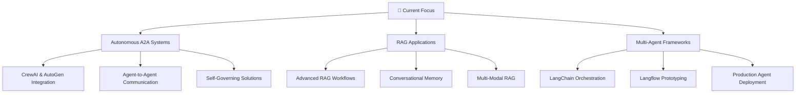

<div align="center">

# Saurabh Kumar Bajpai

<strong>AI Engineer · Open Source Contributor · Agentic Systems</strong>

<br>


<br><br>

**AI · RAG · Backend · Security · Testing · CI/CD**  
**GSSoC #6 (S-Tier) · GSoC 2026 · NSoC 2026**

<br>

<a href="https://gssoc.girlscript.org/profile/6a73d848-056f-4043-a79b-83dfc87113ac">
  
</a>
<a href="https://summerofcode.withgoogle.com/">
  
</a>
<a href="https://github.com/saurabhhhcodes">
  
</a>
<a href="https://github.com/saurabhhhcodes?tab=followers">
  
</a>

<br><br>

<div align="center">
  <a href="https://gssoc.girlscript.org/profile/6a73d848-056f-4043-a79b-83dfc87113ac">
    
    
    
    
    
    
    
    
    
    
    
    
    
    
    
    
  </a>
</div>

<div align="center">
  <a href="https://gssoc.girlscript.org/profile/6a73d848-056f-4043-a79b-83dfc87113ac">
    
    
    
    
    
    
  </a>
</div>

</div>

<br>

### Open Source Work · 2026

I ship working PRs across GSSoC, NSoC, and GSoC-aligned projects — AI systems, backend reliability, security hardening, testing, CI, and documentation.


<br><br>

<div align="center">
  
</div>

<br>

<div align="center">

  

<br>


</div>

## Open Source Programs 2026

- **GirlScript Summer of Code 2026:** Contributor across Open Source + AI/Agents tracks, shipping reviewed PRs in AI/ML, RAG, agentic systems, backend reliability, security hardening, CI/testing, and documentation.
- **Nexus Spring of Code 2026:** Contributor to fast-moving Nexus projects with focus on tested, useful, maintainable changes.
- **Google Summer of Code 2026:** Contributor focused on production-minded implementation, clean architecture, documentation, and reviewer-friendly notes.


## 🌟 Verified Open Source Contributions

<div align="center">

Every repository below represents verified, reviewed, and merged pull requests authored by **saurabhhhcodes**.

</div>

<br/>

### 🤖 AI, ML & Agent Systems

| Project | Upstream Repository | Description | Merged PRs |
|---------|-------------------|-------------|:----------:|
| **ML-Project-CV-Analysis** | [Prashant-Singh-Rawat/ML-Project-CV-Analysis](https://github.com/Prashant-Singh-Rawat/ML-Project-CV-Analysis) | Computer vision analysis pipelines and ML models | **93 PRs** |
| **NexaSphere** | [Ayushh-Sharmaa/NexaSphere](https://github.com/Ayushh-Sharmaa/NexaSphere) | Next-gen AI orchestration & intelligent workflows | **52 PRs** |
| **story-spark-ai** | [ronisarkarexe/story-spark-ai](https://github.com/ronisarkarexe/story-spark-ai) | Creative generative AI storytelling platform | **31 PRs** |
| **MedInternia** | [AnirudhPhophalia/MedInternia](https://github.com/AnirudhPhophalia/MedInternia) | Medical intelligence & clinical case study platform | **18 PRs** |
| **pathfinder-ai** | [harshdwivediiiii/pathfinder-ai](https://github.com/harshdwivediiiii/pathfinder-ai) | AI career advisor with mock interviews & resume review | **11 PRs** |
| **FinSight-AI** | [AakashRathore136/FinSight-AI](https://github.com/AakashRathore136/FinSight-AI) | Financial intelligence & market sentiment analysis | **6 PRs** |
| **ai-code-reviewer** | [kalyan-1845/ai-code-reviewer](https://github.com/kalyan-1845/ai-code-reviewer) | Automated code review and AST linting pipeline | **5 PRs** |
| **Clinical-Insight-Engine** | [gopaljilab/Clinical-Insight-Engine](https://github.com/gopaljilab/Clinical-Insight-Engine) | Clinical decision support & medical records processing | **1 PR** |
| **Eagle** | [Devnil434/Eagle](https://github.com/Devnil434/Eagle) | Production-grade real-time semantic surveillance | **2 PRs** |
| **VidyaSetu** | [MRIARC-08/VidyaSetu](https://github.com/MRIARC-08/VidyaSetu) | AI-powered educational study assistant | **2 PRs** |

### 🌐 Web Applications & Platforms

| Project | Upstream Repository | Description | Merged PRs |
|---------|-------------------|-------------|:----------:|
| **CropChain** | [Nitya-003/CropChain](https://github.com/Nitya-003/CropChain) | AgriTech supply-chain tracking & crop health platform | **113 PRs** |
| **PrepPilot** | [Canopus-Labs/PrepPilot](https://github.com/Canopus-Labs/PrepPilot) | Interview preparation and algorithmic study assistant | **31 PRs** |
| **CreatorOs** | [aashutoshkumarbhardwaj/CreatorOs](https://github.com/aashutoshkumarbhardwaj/CreatorOs) | Operating workspace & analytics for content creators | **9 PRs** |
| **Uni-Event** | [roshankumar0036singh/Uni-Event](https://github.com/roshankumar0036singh/Uni-Event) | Event management & QR attendance platform for universities | **9 PRs** |
| **Cara** | [janavipandole/Cara](https://github.com/janavipandole/Cara) | Full-stack e-commerce experience platform | **8 PRs** |
| **UltimateHealth** | [SB2318/UltimateHealth](https://github.com/SB2318/UltimateHealth) | Health library & wellness article management system | **6 PRs** |
| **NyayaVanni** | [choudharyms/NyayaVanni](https://github.com/choudharyms/NyayaVanni) | Legal assistance platform with vernacular OCR support | **6 PRs** |
| **Astrodex** | [Omnikon-Org/Astrodex](https://github.com/Omnikon-Org/Astrodex) | Interactive astronomy data & space mission catalog | **6 PRs** |
| **symptom-scribe-clean** | [mohdmaazgani/symptom-scribe-clean](https://github.com/mohdmaazgani/symptom-scribe-clean) | Health tracking with daily hydration & blood pressure diary | **4 PRs** |
| **LegalEase** | [AnuranjanJain/LegalEase](https://github.com/AnuranjanJain/LegalEase) | Legal contract summarization & dispute resolution platform | **3 PRs** |
| **Organ_BlockChain** | [jaideep005/Organ_BlockChain](https://github.com/jaideep005/Organ_BlockChain) | Decentralized organ donation and transplant ledger | **3 PRs** |
| **PYSCHECARE-main** | [Shaurya1907/PYSCHECARE-main](https://github.com/Shaurya1907/PYSCHECARE-main) | Mental health care & therapy coordination platform | **3 PRs** |
| **EduBridge** | [AditixAnand/EduBridge](https://github.com/AditixAnand/EduBridge) | Educational access & peer mentorship platform | **2 PRs** |
| **ecoplay** | [arzoo0511/ecoplay](https://github.com/arzoo0511/ecoplay) | Interactive environmental awareness gamification platform | **2 PRs** |

### 🛠️ Developer Tools, Infrastructure & Core Systems

| Project | Upstream Repository | Description | Merged PRs |
|---------|-------------------|-------------|:----------:|
| **Truxify** | [KanishJebaMathewM/Truxify](https://github.com/KanishJebaMathewM/Truxify) | Freight logistics & smart dispatching infrastructure | **53 PRs** |
| **devtrack** | [Priyanshu-byte-coder/devtrack](https://github.com/Priyanshu-byte-coder/devtrack) | Developer workflow analytics and time-tracking tool | **3 PRs** |
| **TermUI** | [Karanjot786/TermUI](https://github.com/Karanjot786/TermUI) | TypeScript framework for building rich terminal applications | **1 PR** |
| **WiseMindOS** | [aaryan498/WiseMindOS](https://github.com/aaryan498/WiseMindOS) | Micro-kernel OS interface & productivity workspace | **1 PR** |
| **KalaOS** | [Vipin-Baniya/KalaOS](https://github.com/Vipin-Baniya/KalaOS) | Operating workspace for digital artists and creators | **1 PR** |
| **TakaTime** | [Rtarun3606k/TakaTime](https://github.com/Rtarun3606k/TakaTime) | Open-source developer time tracking engine in Go | **1 PR** |
| **Saas-workspace-api** | [riya-kaurav/Saas-workspace-api](https://github.com/riya-kaurav/Saas-workspace-api) | RBAC authentication, JWT middleware & project APIs | **1 PR** |
| **spectrax_1** | [Somil450/spectrax_1](https://github.com/Somil450/spectrax_1) | High-performance backend routing & telemetry system | **1 PR** |
| **Vura** | [omn7/Vura](https://github.com/omn7/Vura) | Cryptographic credential & certificate verification engine | **1 PR** |
| **PulseStack** | [sreerevanth/PulseStack](https://github.com/sreerevanth/PulseStack) | Distributed metrics collection and health monitoring | **1 PR** |
| **linkid** | [vishnukothakapu/linkid](https://github.com/vishnukothakapu/linkid) | Decentralized identity & universal profile resolver | **1 PR** |
| **Repo-lyzer** | [agnivo988/Repo-lyzer](https://github.com/agnivo988/Repo-lyzer) | Static source code analyzer and git change comparator | **1 PR** |
| **Glyph** | [coderanik/Glyph](https://github.com/coderanik/Glyph) | Modern typography and icon component library | **1 PR** |
| **AlgoMate** | [PankajSingh18/AlgoMate](https://github.com/PankajSingh18/AlgoMate) | Graph algorithm visualization and debug suite | **1 PR** |
| **DoubtDesk** | [knoxiboy/DoubtDesk](https://github.com/knoxiboy/DoubtDesk) | Peer-to-peer developer doubt solving portal | **1 PR** |

<div align="center">

<br/>


</div>

<br/>


## 🚀 About Me


```javascript
const saurabh = {
    pronouns: "He/Him",
    location: "Lucknow, India 🇮🇳",
    currentRole: "AI Engineer Intern @Akoode Technologies",
    currentFocus: "Multimodal AI Systems, LLM/VLM Fine-tuning & Agent Development",
    languages: ["Python", "Java", "SQL", "JavaScript", "TypeScript", "C++"],
    frontend: ["React", "Next.js", "Vue.js", "React Native", "HTML5", "CSS3", "Tailwind CSS"],
    backend: ["Node.js", "Express.js", "Spring Boot", "Django", "FastAPI"],
    databases: ["MySQL", "PostgreSQL", "MongoDB", "Redis", "Firebase"],
    cloud: ["AWS", "Azure", "Google Cloud", "Docker", "Kubernetes", "Vercel", "Streamlit"],
    aiFrameworks: ["LangChain", "CrewAI", "AutoGen", "Langflow"],
    mlTools: ["PyTorch", "TensorFlow", "Hugging Face", "Scikit-Learn", "Pandas", "NumPy"],
    aiTools: ["OpenAI GPT-4", "Anthropic Claude", "Hugging Face Transformers"],
    bioinformatics: ["BioPython", "Bioconductor", "BLAST", "SAMtools", "GATK"],
    tools: ["Git", "Docker", "AWS", "Firebase", "Vercel", "Streamlit", "VS Code", "IntelliJ IDEA"],
    coreCompetencies: ["System Design", "Data Structures & Algorithms", "A2A Development", "MLOps", "RAG", "Conversational AI"],
    openSourcePrograms: ["GSSoC 2026", "Google Summer of Code 2026", "Nexus Spring of Code 2026"],
    achievements: ["Agent.AI Global Challenge Winner", "GSSoC 2026 Top Contributor", "GSoC 2026 Contributor", "NSoC 2026 Contributor", "TCS HackerQuest Season 10 Round 2 Qualifier", "Google ADK Contributor", "Candidate Master on Codeforces (Top 5%)", "Top 10% on LeetCode"],
    currentlyLearning: ["Google Agent Development Kit (ADK)", "Advanced LLM Orchestration", "Multi-Agent Systems", "Multimodal AI"],
    lookingFor: "High-impact AI/ML Engineering Opportunities at Leading Tech Companies",
    funFact: "I build autonomous agent systems that can talk to each other while solving competitive programming problems! 🤖🧬🚀"
};
```

<div align="center">

## 🚀 Founder & Lead Instructor @ [AxonFlow.in](https://axonflow.in)

**Building the next generation of AI Engineers & Systems**

<a href="https://axonflow.in">
  
</a>
<a href="https://axonflow.in">
  
</a>

At **AxonFlow**, we bridge the gap between theoretical AI and production-grade systems.
- **Agency**: delivering high-performance AI solutions, RAG systems, and autonomous agents for enterprises.
- **Academy**: training aspiring developers in advanced AI engineering, LLM orchestration, and multi-agent systems.

</div>

<div align="center">

## 📊 GitHub Stats & Analytics


</div>

## 🏆 GitHub Trophies

<div align="center">
  


</div>

## 🛠️ Tech Stack & Skills

<div align="center">

### 💻 Programming Languages


### 🌐 Frontend Technologies


### ⚙️ Backend & APIs


### 🗄️ Databases & Cloud


### 📊 Data Science & Machine Learning


### 🤖 AI & Large Language Models


### 🛠️ Tools & Platforms


</div>

## 🏆 Competitive Programming & Data Science Profiles

<div align="center">

### 💻 Competitive Programming
| Platform | Profile | Stats |
|----------|---------|-------|
| 🟡 **LeetCode** | [@saurabhhhcodes](https://leetcode.com/saurabhhhcodes) |  |
| 🔵 **Codeforces** | [@saurabhhhcodes](https://codeforces.com/profile/saurabhhhcodes) |  |
| 🟢 **HackerRank** | [@saurabhhhcodes](https://hackerrank.com/saurabhhhcodes) |  |

### 📊 Data Science & Machine Learning
<a href="https://kaggle.com/saurabhbajpai">
  
</a>
<a href="https://kaggle.com/saurabhbajpai">
  
</a>
<a href="https://kaggle.com/saurabhbajpai">
  
</a>

### 🤖 Machine Learning Expertise


**ML Specializations:**
- 🧠 **Deep Learning**: Neural Networks, CNNs, RNNs, Transformers
- 📈 **Supervised Learning**: Classification, Regression, Ensemble Methods
- 🔍 **Unsupervised Learning**: Clustering, Dimensionality Reduction
- 📊 **Data Analysis**: Statistical Analysis, Feature Engineering, Visualization
- 🤖 **AI Applications**: Computer Vision, NLP, Recommendation Systems
- 🧬 **Bioinformatics AI**: Genomic Analysis, Sequence Processing, Drug Discovery
- 🔗 **LLM Orchestration**: Multi-Model Management, Prompt Engineering, Chain-of-Thought

### 🎯 Coding Achievements


</div>

## 💼 Professional Experience

### 🤖 **AI Engineer Intern** | Akoode Technologies Pvt. Ltd. | Jan 2026 – Present
- **Multimodal AI Systems**: Supporting end-to-end development of AI systems spanning text, image, and audio inputs
- **Data Pipelines**: Built data curation and preprocessing pipelines for high-quality LLM/VLM training datasets
- **Fine-tuning & RAG**: Assisted in fine-tuning LLMs/VLMs and implementing RAG pipelines to improve response accuracy
- **Agentic AI**: Developed agentic AI components enabling intelligent task routing and multimodal reasoning
- **Technologies**: Python, LangChain, RAG, Multimodal AI, LLM/VLM Fine-tuning

### 🌟 **Open Source Contributor** | Google Agent Development Kit (ADK) | 2025 – Present
- **Python & Go Contributions**: Fixed critical runtime errors in RemoteA2aAgent, improving agent communication reliability
- **Function-Call Handling**: Enhanced function-call handling and reasoning trace consistency in multi-agent workflows
- **Testing**: Added unit tests in Python and Go, improving stability and code coverage
- **Technologies**: Python, Go, Agent-to-Agent (A2A) Communication, Multi-Agent Systems

### 🌐 **Open Source Contributor** | GSSoC 2026, GSoC 2026 & NSoC 2026 | 2026 – Present
- **Program Contributions**: Contributing across GirlScript Summer of Code, Google Summer of Code, and Nexus Spring of Code with production-focused PRs
- **AI/ML & Agentic Systems**: Building and improving RAG workflows, agent orchestration, NLP features, OpenCV utilities, and multimodal AI components
- **Security & Reliability**: Shipping security fixes, backend reliability improvements, tests, CI cleanup, documentation, and maintainability upgrades
- **Contribution Discipline**: Reading project guidelines, working on assigned/non-contested issues, keeping PRs reviewed, tested, labeled, and merge-ready

### 💻 **Software Engineer (AI + Backend)** | Freelance (Fiverr) | Aug 2025 – Present
- **Outlook Calendar NLP Assistant**: Built using Microsoft Graph API with 97% intent accuracy
- **OAuth/SSO Integration**: Implemented Google & Microsoft SSO for enterprise chatbot platform chatlly.com
- **You.Fyi Platform**: Developed workspace and digital asset management system with shareable kits
- **Technologies**: Microsoft Graph API, OAuth/SSO, FastAPI, Next.js

### 🔬 **AI/ML Research Intern** | Amity University Bioinformatics Lab | Jul 2025 – Sep 2025
- **OpenBioGen AI**: Developed gene-disease prediction system using custom RAG pipelines
- **ETL Pipelines**: Integrated PubMed, OMIM, and UniProt ETL pipelines, reducing compute latency by 40%
- **Explainability**: Implemented retrieval explainability and reasoning trace modules
- **Technologies**: Langflow, RAG, PubMed API, OMIM, Scientific Literature Processing

### 💻 **Software Engineer Intern (AI/ML)** | Atmohive Biotech | May 2024 – Jul 2024
- **GeneInsight SaaS**: Created bioinformatics SaaS reducing DNA analysis time by 80-90%
- **NLP Modules**: Built conversational NLP modules and 3D molecular visualization tools
- **Multi-tenant Dashboard**: Delivered RBAC-enabled dashboard used by 100+ researchers
- **Technologies**: Spring Boot, React, Three.js, NLP, Multi-tenant Architecture

## 🌟 Current Focus & Learning Path

<div align="center">


```mermaid
graph TD
    A[🎯 Current Focus] --> B[Autonomous A2A Systems]
    A --> C[RAG Applications]
    A --> D[Multi-Agent Frameworks]
    
    B --> E[CrewAI & AutoGen Integration]
    B --> F[Agent-to-Agent Communication]
    B --> G[Self-Governing Solutions]
    
    C --> H[Advanced RAG Workflows]
    C --> I[Conversational Memory]
    C --> J[Multi-Modal RAG]
    
    D --> K[LangChain Orchestration]
    D --> L[Langflow Prototyping]
    D --> M[Production Agent Deployment]
```

### 🚀 Currently Working On
- 🤖 **Autonomous A2A Systems** - Agent-to-Agent communication platforms with CrewAI/AutoGen
- 📅 **Outlook Calendar AI** - Multi-tenant platform with Microsoft Graph API integration
- 💬 **Chatlly Enhancement** - RAG assistant with OAuth/SSO and conversational memory
- 🔬 **Catalyst Bio Platform** - Next-generation bioinformatics with multi-agent architecture
- 🌐 **GSSoC/GSoC/NSoC Contributions** - Merge-ready open-source PRs across AI, security, backend, testing, docs, and developer tooling
- 🏆 **Competitive Programming** - Candidate Master level problem-solving (Top 5% Codeforces)
- 🎯 **Production RAG Systems** - Scalable retrieval-augmented generation applications

</div>

## 🚀 Featured Projects & Systems

<div align="center">

### 🎙️ **[Verve](https://github.com/saurabhhhcodes/verve)** — Real-Time Voice AI Sales & Negotiation Agent
**🌐 Built for EchoSphere Agora Conversational AI Hackathon (Team HardRock)**
- **Stack**: Python, FastAPI, Agora Conversational AI, WebRTC, LLM Integration
- **Features**: Low-latency spoken customer qualification, rolling session memory, real-time objection handling & CRM automation

---

### 🏆 **[Deal Doctor](https://agent.ai/agent/thedealdoctor)** — Agent.AI Global Challenge Winner
**🌐 [AGENT.AI LIVE AGENT](https://agent.ai/agent/thedealdoctor) — Autonomous HubSpot CRM Automation System**
- **Stack**: Agent.AI, HubSpot API, Multi-Agent System, Autonomous Orchestration
- **Features**: Intelligent deal pipeline management, automated lead scoring, autonomous follow-ups & CRM synchronization

---

### 🏆 **[Chatlly RAG Assistant](https://pal.chatlly.com/)** — Enterprise Knowledge Assistant
**🌐 [LIVE PLATFORM](https://pal.chatlly.com/) · [GitHub](https://github.com/saurabhhhcodes/Chatlly)**
- **Stack**: FastAPI, Next.js, Chroma, OpenAI, AgentKit, OCR
- **Features**: Multi-format document ingestion (PDF, CSV, DOCX), OAuth/SSO, conversational memory, agentic reasoning
- **Security**: Bearer token auth, source citations, metadata tracking, Docker deployment

---

### 🧠 **[HelixMind](https://helixmind.onrender.com)** — Gemini 2.0 Flash Thinking AI Platform
**🌐 [LIVE APP](https://helixmind.onrender.com) · [GitHub](https://github.com/saurabhhhcodes/HelixMind)**
- **Stack**: React, Flask, Google Gemini 2.0 Flash Thinking API, Render
- **Features**: Real-time streaming reasoning traces, multi-turn cognitive workflows, high-precision problem solving

---

### 🤖 **[Sahayak.AI](https://sahayak-ai.vercel.app)** — Open-Source Multi-LLM Assistant Platform
**🌐 [LIVE PLATFORM](https://sahayak-ai.vercel.app) · [GitHub](https://github.com/saurabhhhcodes/SahayakAI)**
- **Stack**: React, FastAPI, LangChain, Multi-LLM Fallback (Groq, Claude, OpenRouter, HuggingFace)
- **Features**: Video search, image generation, mermaid diagram rendering, zero rate-limit fallback routing

---

### 📅 **[AI Outlook Calendar Agent](https://ai-outlook-calendar-agent.streamlit.app/)** — Multi-Tenant Calendar Management
**🌐 [LIVE APP](https://ai-outlook-calendar-agent.streamlit.app/) · [GitHub](https://github.com/saurabhhhcodes/ai-outlook-calendar-agent)**
- **Stack**: Microsoft Graph API, LangChain, OAuth 2.0, Multi-tenant Architecture
- **Impact**: 40% reduction in administrative overhead for calendar management with personal/work account auth

---

### 🧬 **[OpenBioGen-AI](https://openbiogen-ai.streamlit.app/)** — Professional Bioinformatics Platform
**🌐 [LIVE DEMO](https://openbiogen-ai.streamlit.app/) · [GitHub](https://github.com/saurabhhhcodes/OpenBioGen-AI)**
- **Stack**: Streamlit, LangChain, HuggingFace Transformers, Tavily API, PubMed/OMIM ETL
- **Features**: Gene-disease association prediction, clinical decision support, network analysis, retrieval explainability

---

### 🧬 **[GeneInsight Platform](https://geneinsight-platform.vercel.app/)** — AI-Enhanced SaaS Bioinformatics
**🌐 [LIVE SAAS](https://geneinsight-platform.vercel.app/) · [GitHub](https://github.com/saurabhhhcodes/geneinsight-platform)**
- **Stack**: Next.js 15, Spring Boot 3.2, Python Flask, LangChain, PostgreSQL
- **Features**: Conversational AI assistant, molecular docking, 3D visualization, COVID-19 genomic analysis

---

### 🌱 **[Smart Plant Care Assistant](https://smart-plant-care-langchain.streamlit.app/)** — AI Plant Health Monitor
**🌐 [LIVE APP](https://smart-plant-care-langchain.streamlit.app/) · [GitHub](https://github.com/saurabhhhcodes/smart-plant-care-assistant)**
- **Stack**: Streamlit, LangChain, OpenCV, Multi-LLM Vision (OpenAI, Anthropic, Meta)
- **Features**: Plant disease detection from leaf images, confidence scores, custom care treatment recommendations

---

### 🥗 **[NutriSync](https://aistudio.google.com/app/drive/1sl1Lf2U2UIRE1p9nPMjDzUvSqmT6iORt?showPreview=true&showAssistant=true)** — Dietary Intelligence & Fitness Platform
**🌐 [LIVE APP](https://aistudio.google.com/app/drive/1sl1Lf2U2UIRE1p9nPMjDzUvSqmT6iORt?showPreview=true&showAssistant=true) · [GitHub](https://github.com/saurabhhhcodes/Nutri-Sync)**
- **Stack**: React, Node.js, MongoDB, OpenAI API, Nutrition Intelligence APIs
- **Features**: AI-driven meal planning, barcode calorie scanning, personalized workout routines, progress analytics

---

### 🏰 **[Prestige Estates](https://legendary-tapioca-50caa6.netlify.app)** — Ultra-Luxury Real Estate Web Platform
**🌐 [LIVE WEBSITE](https://legendary-tapioca-50caa6.netlify.app) · [GitHub](https://github.com/saurabhhhcodes/prestige-estates)**
- **Stack**: HTML5, Vanilla CSS3, JavaScript, Glassmorphic UI, Netlify CLI
- **Features**: Interactive property showcase for Irvine CA, search filters, luxury photo galleries, enquiry modals

---

### ✈️ **[Wanderlux Landing](https://animated-profiterole-542134.netlify.app)** — Ultra-Luxury Bespoke Travel Landing
**🌐 [LIVE WEBSITE](https://animated-profiterole-542134.netlify.app) · [GitHub](https://github.com/saurabhhhcodes/wanderlux-landing)**
- **Stack**: HTML5, CSS3, Unsplash HD Media, Micro-animations, Custom Design System
- **Features**: Curated destination showcases (Amalfi Coast, Kyoto, Patagonia), booking modals, dark aesthetic

</div>

<br>

## 🌟 Featured Open Source Contributions

<div align="center">

### 🤖 AI & Agents

| Project | Contribution Highlights | Upstream Repository |
|---------|------------------------|-------------------|
| **NexaSphere** | Architecture refactoring, multi-agent pipeline validation & state synchronization | [Ayushh-Sharmaa/NexaSphere](https://github.com/Ayushh-Sharmaa/NexaSphere) |
| **story-spark-ai** | Generative AI pipeline reliability, async token streaming & error boundaries | [ronisarkarexe/story-spark-ai](https://github.com/ronisarkarexe/story-spark-ai) |
| **pathfinder-ai** | Mock interview response parsing, evaluation metrics & prompt engineering | [harshdwivediiiii/pathfinder-ai](https://github.com/harshdwivediiiii/pathfinder-ai) |
| **FinSight-AI** | Market data integration, sentiment analysis fixes & caching | [AakashRathore136/FinSight-AI](https://github.com/AakashRathore136/FinSight-AI) |
| **ai-code-reviewer** | Redis connection lifecycle fixes, rate limiting & AST rule expansions | [kalyan-1845/ai-code-reviewer](https://github.com/kalyan-1845/ai-code-reviewer) |

### 🛠️ Developer Tools & Infrastructure

| Project | Contribution Highlights | Upstream Repository |
|---------|------------------------|-------------------|
| **Truxify** | Escrow contracts, API payload validation & WebSocket reliability | [KanishJebaMathewM/Truxify](https://github.com/KanishJebaMathewM/Truxify) |
| **CreatorOs** | User permission hierarchies, analytics aggregations & UI stability | [aashutoshkumarbhardwaj/CreatorOs](https://github.com/aashutoshkumarbhardwaj/CreatorOs) |
| **Uni-Event** | Duplicate RSVP prevention, attendance sync & empty state UI | [roshankumar0036singh/Uni-Event](https://github.com/roshankumar0036singh/Uni-Event) |
| **Saas-workspace-api** | Project routing schema, JWT token authentication middleware | [riya-kaurav/Saas-workspace-api](https://github.com/riya-kaurav/Saas-workspace-api) |
| **TermUI** | Type-only import optimizations, ANSI styling fixes for KeyValue widgets | [Karanjot786/TermUI](https://github.com/Karanjot786/TermUI) |

### 🌐 Web & Full Stack

| Project | Contribution Highlights | Upstream Repository |
|---------|------------------------|-------------------|
| **CropChain** | Smart contract data bindings, soil telemetry schemas & UI fixes | [Nitya-003/CropChain](https://github.com/Nitya-003/CropChain) |
| **PrepPilot** | Problem categorization, test runner harnesses & progress trackers | [Canopus-Labs/PrepPilot](https://github.com/Canopus-Labs/PrepPilot) |
| **UltimateHealth** | Article pagination error boundaries, tap race condition prevention | [SB2318/UltimateHealth](https://github.com/SB2318/UltimateHealth) |
| **symptom-scribe-clean** | Daily hydration tracker, blood pressure diary with hypertension classification | [mohdmaazgani/symptom-scribe-clean](https://github.com/mohdmaazgani/symptom-scribe-clean) |
| **NyayaVanni** | OCR text quality confidence meter, legal article index search | [choudharyms/NyayaVanni](https://github.com/choudharyms/NyayaVanni) |

<br/>


</div>

<br>

<div align="center">
  
</div>

<br>

## 📫 Let's Connect!

<div align="center">

<a href="https://linkedin.com/in/saurabhbajpai03">
  
</a>
<a href="mailto:saurabhbajpai03@outlook.com">
  
</a>
<a href="https://github.com/saurabhhhcodes">
  
</a>
<a href="https://twitter.com/saurabhhhcodes">
  
</a>
<a href="https://dev.to/saurabhhhcodes">
  
</a>

### 💬 Feel free to reach out for:
- 🤝 **Collaboration opportunities** on innovative projects
- 💼 **Software engineering roles** in tech companies
- 🧠 **Technical discussions** about new technologies
- 📚 **Knowledge sharing** and mentorship
- 🚀 **Open source contributions** and community building

</div>

<div align="center">

### 👀 Profile Views


---


**"The best code is no code at all."** – Jeff Atwood

**Thanks for visiting my profile. Let's build useful systems and reliable open source.**

</div>


<!-- Last updated: September 01, 2026 at 04:05 UTC -->
