<div align="center">
  
# Hi there, I'm Saurabh Bajpai 👋


</div>

## 🚀 About Me


```javascript
const saurabh = {
    pronouns: "He/Him",
    location: "India 🇮🇳",
    currentFocus: "Software Development",
    languages: ["Java", "Python", "JavaScript", "SQL"],
    databases: ["MySQL", "PostgreSQL", "MongoDB"],
    frameworks: ["Spring Boot", "Django", "React"],
    tools: ["Git", "Docker", "AWS", "Linux"],
    currentlyLearning: ["Cloud Technologies", "Microservices", "DevOps"],
    lookingFor: "Software Development Opportunities",
    funFact: "I debug with console.log() and I'm not ashamed! 😄"
};
```

<div align="center">

## 📊 GitHub Stats & Analytics


</div>

## 🏆 GitHub Trophies

<div align="center">
  


</div>

## 🛠️ Tech Stack & Skills

<div align="center">

### 💻 Programming Languages


### 🌐 Web Technologies  


### 🗄️ Databases & Cloud


### 🔧 Tools & Platforms


</div>

## 🏆 Competitive Programming Profiles

<div align="center">

| Platform | Profile | Stats |
|----------|---------|-------|
| 🟡 **LeetCode** | [@saurabhhhcodes](https://leetcode.com/saurabhhhcodes) |  |
| 🔵 **Codeforces** | [@saurabhhhcodes](https://codeforces.com/profile/saurabhhhcodes) |  |
| 🟢 **Kaggle** | [@saurabhbajpai](https://kaggle.com/saurabhbajpai) |  |

</div>

## ✨ 4D Visualization & Interactive Elements

<div align="center">

### 🌟 3D Contribution Graph


### 📈 Dynamic Activity Metrics


### 🎯 Skill Progress Visualization


</div>

## 🌟 Current Projects & Learning

```mermaid
graph TD
    A[🎯 Current Focus] --> B[Software Development]
    A --> C[Cloud Technologies]
    A --> D[System Design]
    
    B --> E[Java Spring Boot]
    B --> F[Python Django]
    B --> G[React.js]
    
    C --> H[AWS Services]
    C --> I[Docker & Kubernetes]
    C --> J[Microservices]
    
    D --> K[Database Design]
    D --> L[API Architecture]
    D --> M[Performance Optimization]
```

<div align="center">



</div>

## 📫 Let's Connect!

<div align="center">

<a href="https://www.linkedin.com/in/saurabhbajpai03">
  
</a>
<a href="mailto:saurabhbajpai03@outlook.com">
  
</a>
<a href="https://github.com/saurabhhhcodes">
  
</a>

### 💬 Feel free to reach out for:
- 🤝 Collaboration opportunities
- 💼 Software development roles
- 🧠 Tech discussions
- 📚 Knowledge sharing

</div>

<div align="center">

### 👀 Profile Views


---


**"Code is like humor. When you have to explain it, it's bad."** – Cory House


</div>
