<div align="center">
  
# Hi there, I'm Saurabh Bajpai 👋


</div>

## 🚀 About Me


```javascript
const saurabh = {
    pronouns: "He/Him",
    location: "India 🇮🇳",
    currentFocus: "AI/ML & Bioinformatics Development",
    languages: ["Java", "Python", "JavaScript", "TypeScript", "C++", "SQL"],
    frontend: ["React", "Next.js", "Vue.js", "HTML5", "CSS3", "Tailwind CSS"],
    backend: ["Node.js", "Express.js", "Spring Boot", "Django", "FastAPI"],
    databases: ["MySQL", "PostgreSQL", "MongoDB", "Redis", "Firebase"],
    cloud: ["AWS", "Azure", "Google Cloud", "Docker", "Kubernetes"],
    mlTools: ["TensorFlow", "PyTorch", "Scikit-Learn", "Pandas", "NumPy"],
    aiTools: ["LangChain", "OpenAI GPT-4", "Anthropic Claude", "Hugging Face", "Transformers"],
    bioinformatics: ["BioPython", "Bioconductor", "BLAST", "SAMtools", "GATK"],
    tools: ["Git", "VS Code", "IntelliJ IDEA", "Jupyter", "Postman"],
    currentlyLearning: ["Advanced LLM Orchestration", "Bioinformatics AI", "Genomic Analysis"],
    lookingFor: "AI/ML & Bioinformatics Engineering Opportunities",
    funFact: "I can orchestrate LLMs and analyze genomic sequences while solving competitive programming problems! 🤖🧬🚀"
};
```

<div align="center">

## 📊 GitHub Stats & Analytics


</div>

## 🏆 GitHub Trophies

<div align="center">
  


</div>

## 🛠️ Tech Stack & Skills

<div align="center">

### 💻 Programming Languages


### 🌐 Frontend Technologies


### ⚙️ Backend & APIs


### 🗄️ Databases & Cloud


### 📊 Data Science & Machine Learning


### 🤖 AI & Large Language Models


### 🛠️ Tools & Platforms


</div>

## 🏆 Competitive Programming & Data Science Profiles

<div align="center">

### 💻 Competitive Programming
| Platform | Profile | Stats |
|----------|---------|-------|
| 🟡 **LeetCode** | [@saurabhhhcodes](https://leetcode.com/saurabhhhcodes) |  |
| 🔵 **Codeforces** | [@saurabhhhcodes](https://codeforces.com/profile/saurabhhhcodes) |  |
| 🟢 **HackerRank** | [@saurabhhhcodes](https://hackerrank.com/saurabhhhcodes) |  |

### 📊 Data Science & Machine Learning
<a href="https://kaggle.com/saurabhbajpai">
  
</a>
<a href="https://kaggle.com/saurabhbajpai">
  
</a>
<a href="https://kaggle.com/saurabhbajpai">
  
</a>

### 🤖 Machine Learning Expertise


**ML Specializations:**
- 🧠 **Deep Learning**: Neural Networks, CNNs, RNNs, Transformers
- 📈 **Supervised Learning**: Classification, Regression, Ensemble Methods
- 🔍 **Unsupervised Learning**: Clustering, Dimensionality Reduction
- 📊 **Data Analysis**: Statistical Analysis, Feature Engineering, Visualization
- 🤖 **AI Applications**: Computer Vision, NLP, Recommendation Systems
- 🧬 **Bioinformatics AI**: Genomic Analysis, Sequence Processing, Drug Discovery
- 🔗 **LLM Orchestration**: Multi-Model Management, Prompt Engineering, Chain-of-Thought

### 🎯 Coding Achievements


</div>

## 🌟 Current Focus & Learning Path

```mermaid
graph TD
    A[🎯 Current Focus] --> B[AI/ML & Bioinformatics]
    A --> C[LLM Orchestration]
    A --> D[Genomic Analysis]
    
    B --> E[LangChain & OpenAI Integration]
    B --> F[Bioinformatics AI Tools]
    B --> G[Drug Discovery Platforms]
    
    C --> H[Multi-LLM Orchestration]
    C --> I[Prompt Engineering]
    C --> J[Chain-of-Thought Reasoning]
    
    D --> K[Sequence Analysis]
    D --> L[Genomic Data Processing]
    D --> M[Bioinformatics Workflows]
```

<div align="center">



### 🚀 Currently Working On
- 🧬 **OpenBioGen-AI Platform** - AI-powered bioinformatics analysis
- 🧬 **GeneInsight Platform** - Comprehensive genomic analysis tools
- 📊 **Sequence Analysis Tools** - DNA/RNA processing with AI integration
- 🏆 **Competitive Programming** - Advanced algorithm practice
- 🔬 **Bioinformatics Research** - Genomic data analysis and interpretation

</div>

## 🚀 Featured Projects

<div align="center">

### 🧬 **[OpenBioGen-AI](https://github.com/saurabhhhcodes/openbiogen-ai)** - AI-Powered Bioinformatics Platform
**Revolutionary AI-driven platform for genomic analysis and drug discovery**
- 🤖 **Tech Stack**: Python, LangChain, OpenAI GPT-4, React, FastAPI, PostgreSQL, Redis
- 🎯 **Features**: AI-powered sequence analysis, drug target prediction, genomic insights
- 📊 **Capabilities**: Large Language Model orchestration, automated bioinformatics workflows
- 🌟 **Highlights**: LangChain integration, real-time AI processing, comprehensive genomic database
- 🏆 **Status**: Active development with cutting-edge AI integration
- 🔬 **AI/ML**: Advanced LLM orchestration, custom bioinformatics prompts, automated analysis

---

### 🧬 **[GeneInsight Platform](https://github.com/saurabhhhcodes/geneinsight-platform)** - Advanced Bioinformatics Analysis
**Comprehensive bioinformatics platform for genetic data analysis and visualization**
- 🔬 **Tech Stack**: Python, React, FastAPI, PostgreSQL, Docker, LangChain
- 🎯 **Features**: Gene sequence analysis, mutation detection, phylogenetic analysis
- 📊 **Impact**: Streamlines genetic research workflows for researchers
- 🌟 **Highlights**: Interactive visualizations, real-time processing, export capabilities
- 🏆 **Status**: Production-ready with 100+ active users
- 🤖 **AI Integration**: LangChain-powered analysis, automated report generation

---

### 🧬 **[Sequence Analysis Tool](https://github.com/saurabhhhcodes/SequenceAnalysisTool)** - DNA/RNA Processing Suite
**Comprehensive toolkit for biological sequence analysis and manipulation**
- 🔬 **Tech Stack**: Python, BioPython, NumPy, Matplotlib, LangChain, OpenAI
- 🎯 **Features**: Sequence alignment, motif finding, GC content analysis
- 📈 **Capabilities**: Statistical analysis, pattern recognition, format conversion
- 🌟 **Highlights**: Command-line interface, batch processing, detailed reports
- 🚀 **Status**: Core functionality complete, AI enhancements in progress
- 🤖 **AI Features**: LangChain integration for intelligent sequence interpretation

---

### 🔒 **[Secure Agent Scheduler](https://github.com/saurabhhhcodes/secure-agent-scheduler)** - Secure Task Scheduling
**A secure and reliable task scheduler for autonomous agents**
- 💻 **Tech Stack**: Python, FastAPI, Docker, Kubernetes
- 🎯 **Features**: Secure task scheduling, agent management, encrypted communication
- 🌟 **Highlights**: JWT-based authentication, role-based access control, scalable architecture
- 🚀 **Status**: In active development

---

### 🌱 **[Smart Plant Care Assistant](https://github.com/saurabhhhcodes/smart-plant-care-assistant)** - Automated Plant Monitoring
**An IoT-based system for monitoring and watering plants automatically**
- 💻 **Tech Stack**: Python, Flask, Raspberry Pi, Arduino, MQTT
- 🎯 **Features**: Real-time monitoring of soil moisture, temperature, and humidity
- 🌟 **Highlights**: Automated watering system, data visualization, mobile notifications
- 🚀 **Status**: Prototype completed


### 📊 Project Statistics


</div>

## 📫 Let's Connect!

<div align="center">

<a href="https://www.linkedin.com/in/saurabhbajpai03">
  
</a>
<a href="mailto:saurabhbajpai03@outlook.com">
  
</a>
<a href="https://github.com/saurabhhhcodes">
  
</a>
<a href="https://twitter.com/saurabhhhcodes">
  
</a>
<a href="https://dev.to/saurabhhhcodes">
  
</a>

### 💬 Feel free to reach out for:
- 🤝 **Collaboration opportunities** on innovative projects
- 💼 **Software engineering roles** in tech companies
- 🧠 **Technical discussions** about new technologies
- 📚 **Knowledge sharing** and mentorship
- 🚀 **Open source contributions** and community building

</div>

<div align="center">

### 👀 Profile Views


---


**"The best code is no code at all."** – Jeff Atwood


</div>

<!-- Last updated: October 21, 2025 at 18:18 UTC -->
